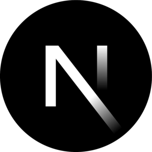

<!-- Add a Header Image -->
<!-- 

  

-->
<h1 align="center">👋 Welcome to My GitHub Profile! 🚀</h1>

## About Me

Hello there! 👨‍💻 I'm Nasreddine Boudellal, a passionate Front End Developer with 4 years of experience in the industry. I love crafting engaging and user-friendly web experiences that make a positive impact. From building simple and intuitive portfolios to creating interactive web applications, I enjoy every aspect of web development.

With a keen eye for design and a passion for creating seamless user experiences, I take pride in building responsive and accessible web applications that delight users across devices. 🌐💻

## Technologies and Tools I Use

As a Front End Developer, here are some of the technologies and tools I work with:

  &nbsp;&nbsp;&nbsp;
  &nbsp;&nbsp;&nbsp;
  &nbsp;&nbsp;&nbsp;
  &nbsp;&nbsp;&nbsp;
  &nbsp;&nbsp;&nbsp;
  &nbsp;&nbsp;&nbsp;
  &nbsp;&nbsp;&nbsp;
  &nbsp;&nbsp;&nbsp;
  &nbsp;&nbsp;&nbsp;
  &nbsp;&nbsp;&nbsp;
  &nbsp;&nbsp;&nbsp;
  

## My GitHub Projects

Feel free to explore some of the projects I've worked on:

1. **Quiz App** 🎯
   "Quiz App" is a web application where users can answer questions by choosing the category, difficulty, and number of questions. It's a fun way to test your knowledge! The app is built using React.js and leverages external APIs to fetch quiz questions. It also utilizes the "react-router-dom" library for smooth navigation between different sections of the app.

   [Quiz App Repository](https://github.com/nasreddine19/Quiz-app)

2. **My Portfolio** 📂
   This is my personal portfolio, showcasing my skills, projects, and experiences as a Front End Developer. My portfolio is built using React.js, making it fully interactive and responsive. It also features icons from "react-icons" for visual elements.

   [My Portfolio Repository](https://github.com/nasreddine19/my-portfolio)

3. **Todo List** ✅
   A simple yet effective todo list application to keep track of your tasks and stay organized. This app is built using Snowpack and TypeScript, providing a fast and efficient development workflow.

   [Todo List Repository](https://github.com/nasreddine19/Todo-List)

## Let's Connect 🤝

I'm always open to connecting with fellow developers, sharing knowledge, and collaborating on exciting projects. Whether you have questions about my projects or want to discuss potential collaborations, feel free to reach out to me! 📬

- **Email:** [ns.boudellal@gmail.com](mailto:ns.boudellal@gmail.com) 📧
- **LinkedIn:** [LinkedIn Profile](https://www.linkedin.com/in/nasreddine-boudellal-2654b2285/) 💼
- **Twitter:** [@nasro_boudellal](https://twitter.com/nasro_boudellal) 🐦

Looking forward to connecting with you! Let's make the web a better place together! 🌈
